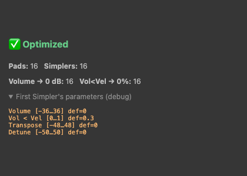

# Drum Rack Optimize Volume

A tiny [Ableton Live](https://www.ableton.com/) extension that resets every pad in a Drum Rack to a clean
starting point in one click — built with the new **Ableton Extensions SDK** (beta).

Right-click a Drum Rack → **Optimize Volume (0 dB · Vol<Vel 0%)** and it instantly:

- sets every **Simpler** pad's **Volume to 0 dB**,
- sets **Vol < Vel to 0%** on all pads,
- all wrapped in **one undo step** (⌘Z to revert).

Great for consistent gain staging across a kit before you start mixing — no more pads randomly sitting at
-12 dB or velocity ducking your hits. It also shows a quick summary of what it changed:



## Requirements

- Ableton **Live 12** build that supports Extensions (the Extensions SDK is currently in **beta**).
- **Developer Mode** enabled: *Preferences → Extensions → Developer Mode*.

## Install (prebuilt)

1. Download `Drum-Rack-Optimize-Volume-x.y.z.ablx` from the [Releases](../../releases) page.
2. In Live: *Preferences → Extensions → Install Extension…* → pick the `.ablx`.
3. Activate it and restart Live.
4. Right-click a Drum Rack → **Optimize Volume (0 dB · Vol<Vel 0%)**.

## Build from source

This project depends on the **Ableton Extensions SDK** packages (`@ableton-extensions/sdk` and
`@ableton-extensions/cli`), distributed by Ableton as a beta `.tgz` bundle — they are **not** included here.

1. Get the Extensions SDK beta from Ableton and note the path to the extracted folder
   (it contains `ableton-extensions-sdk-*.tgz` and `ableton-extensions-cli-*.tgz`).
2. Point the `file:` paths in [`package.json`](package.json) at those `.tgz` files.
3. Install & build:
   ```bash
   npm install
   npm run build      # type-check + bundle to dist/
   npm run package    # production build + .ablx archive
   ```
4. Dev mode (loads straight into a running Live with Developer Mode on):
   ```bash
   npm start
   ```

## How it works

For each pad chain in the Drum Rack it finds the `Simpler` device and, via the SDK's `DeviceParameter` API:

- **Volume** → `0` (Simpler's Volume is in dB, so `0` = 0 dB; falls back to the parameter default if the
  range isn't a dB range),
- **Vol < Vel** → the bottom of its range (`0%`).

All changes run inside a single `withinTransaction(...)` so it's one undo step.

## Notes & limitations

- Works on **Simpler**-based pads. Sampler / Drum Cell aren't exposed as classes by the current SDK, so
  those pads are skipped (the result dialog reports this).
- The Extensions SDK is beta; APIs and behavior may change.

## License

[MIT](LICENSE)
